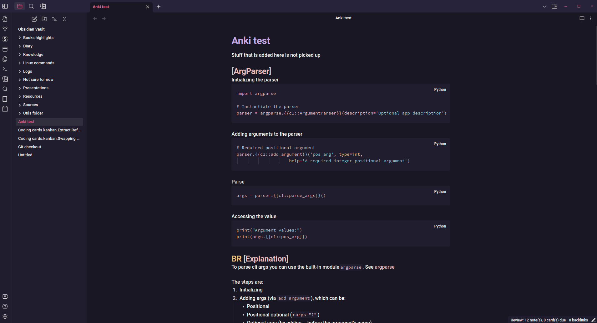

# Rosé Pine for Obsidian

This is a dark theme for Obsidian inspired by the [Rosé Pine Palette](https://rosepinetheme.com/palette) and the theme [Obsidian Nord](https://github.com/insanum/obsidian_nord) that I've quickly put together.  
As of now, it's not in the official themes, which means you need to install it manually.

## Images

## Installation

To use the theme, clone this repository and move the `Rosé Pine.css` file into your Obsidian themes' folder.  
It should now appear with the other themes (it might have `(Legacy)` written next to it).

## Contributing

Pull requests are welcome!
The theme currently lacks a light version, which could be a very nice contribution. :)
Also, since it was put together quickly, the code style could also be improved!

## Versioning

I use [Semantic Versioning](http://semver.org/) for versioning. 
You can read the [changelog file](CHANGELOG.md) to know more about the current and previous versions of this project.

## License

This project is licensed under the [MIT License](LICENSE.md).

